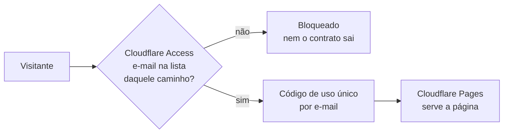

# Portal do Barramento — publicação e controle de acesso

Documentação da API do Barramento Neoh × HIS, escrita em **OpenAPI 3.0.3** e renderizada com
**Redoc**. A fonte da verdade é o **código** (`Barramento.cs` + os controllers da `CC.Api`);
o contrato publicado é conferido campo a campo contra ele a cada alteração.

## O que tem no pacote

| Arquivo | Função |
|---|---|
| `openapi.yaml` | Contrato completo, com Tasy e MV juntos. **É o único arquivo a editar à mão.** |
| `tasy/index.html` + `tasy/openapi-tasy.yaml` | Página do **Tasy** — comuns + Tasy. Gerados. |
| `mv/index.html` + `mv/openapi-mv.yaml` | Página do **MV** — comuns + MV. Gerados. |
| `de-para/index.html` | **De-para** portal × código, uso interno. Gerada de dados. |
| `index.html` | Página neutra da raiz: não leva a lugar nenhum. Gerada. |
| `_headers` | Cabeçalhos do Cloudflare Pages: `noindex` e sem cache do contrato. |
| `robots.txt` | Bloqueia indexação. |
| `.nojekyll` | Herança do GitHub Pages; inofensivo. |

Não existe página "Geral": o que vale para qualquer HIS é publicado **dentro** da página de
cada HIS, marcado operação a operação como comum. Um hospital Tasy lê uma página só.

**O contrato de cada HIS mora dentro da pasta dele**, e não na raiz. Isso não é detalhe de
organização: é o que permite proteger por caminho. Se o `openapi-tasy.yaml` ficasse na raiz,
liberar `/tasy*` para o integrador não bastaria — a página abriria e o Redoc levaria erro ao
buscar o contrato.

### Os endereços

| Quem | Link |
|---|---|
| Hospital/integrador **Tasy** | `<site>/tasy/` |
| Hospital/integrador **MV** | `<site>/mv/` |
| Time interno (de-para) | `<site>/de-para/` |
| Raiz | página neutra, sem links |

Cada página é **isolada**: não tem barra de abas nem link para as outras. Quem recebe o
endereço do Tasy não vê que existe um `/mv/` ou um `/de-para/`. Isso **esconde, não protege** —
quem digitar `/mv/` chega lá. O que protege é a política por caminho, abaixo.

## Como o acesso funciona



O bloqueio acontece **antes** do arquivo ser servido, para qualquer URL — inclusive um
`.yaml` aberto direto na barra. É isso que uma trava em JavaScript dentro da página não faz.

## Publicar (uma vez)

**1. Criar o projeto no Cloudflare Pages**

*Workers & Pages → Create → Pages → Connect to Git* → repositório
`barramentointelectah/barramento.intelectah-docs`, branch `main`.

| Campo | Valor |
|---|---|
| Framework preset | None |
| Build command | *(vazio)* |
| Build output directory | `/` |

Aguarde o primeiro deploy: nasce um endereço `<projeto>.pages.dev`. Guarde-o — é o `<site>`
de todos os passos seguintes.

**2. Ligar o código por e-mail**

*Zero Trust → Settings → Authentication → Login methods*: deixe **One-time PIN** ligado. É o
que faz o visitante externo receber um código no e-mail, sem precisar criar conta.

**3. Criar quatro aplicações, uma por público**

*Zero Trust → Access → Applications → Add an application → Self-hosted*. Em cada uma, a
**Session duration** de 24 horas é um bom começo.

| # | Application domain | Path | Política: Include | Quem entra |
|---|---|---|---|---|
| 1 | `<site>` | `tasy` | Emails → lista dos integradores Tasy | Integrador Tasy |
| 2 | `<site>` | `mv` | Emails → lista dos integradores MV | Integrador MV |
| 3 | `<site>` | `de-para` | Emails ending in → `@intelectah.com.br` | Só a Intelectah |
| 4 | `<site>` | *(vazio)* | Emails ending in → `@intelectah.com.br` | Só a Intelectah |

A de número 4 é a rede de segurança: pega a raiz, o `openapi.yaml` completo e qualquer arquivo
novo que apareça. O Access casa sempre o caminho mais específico primeiro, então as três de
cima continuam valendo. Em todas, **Action: Allow**.

Acrescente a você mesmo na lista de cada uma das quatro, senão você se tranca para fora.

**4. Desligar o GitHub Pages — este passo não é opcional**

*Settings → Pages* do repositório: desligue. Enquanto o Pages estiver no ar,
`barramentointelectah.github.io/barramento.intelectah-docs` serve tudo sem pedir nada, e a
proteção do Cloudflare vale só para o endereço do Cloudflare.

Em seguida, **torne o repositório privado** (*Settings → General → Danger Zone*). O Cloudflare
continua publicando normalmente — a conexão dele com o Git não depende de o repositório ser
público.

**5. Repositório antigo** (`thiagopaz/barramento-docs`): desligue o Pages dele e arquive.

## Dar e tirar acesso

Tudo na política da aplicação do público em questão, sem tocar no repositório:

- **Liberar alguém:** acrescente o e-mail em *Include → Emails* e salve. Vale na hora.
- **Tirar o acesso:** remova o e-mail e, em *Access → Sessions*, revogue as sessões ativas
  daquela pessoa — senão ela segue dentro até a sessão expirar.
- **Quem entrou e quando:** *Zero Trust → Logs → Access*.
- O link `Sair` no topo do portal chama `/cdn-cgi/access/logout` e encerra a sessão.

Mantenha o registro de quem tem acesso em `OFICIAL/ACESSOS-PORTAL.md`. O registro é nosso; a
lista que vale é a do Cloudflare.

## Atualizar a documentação

1. Edite `openapi.yaml`. Qualquer ajuste de contrato reflete o **código** — nunca o contrário.
2. Confira contra o código. A conferência também recusa YAML com chave duplicada, que derruba
   o Redoc inteiro:
   ```bash
   cd OFICIAL
   python3 .sync/conferir-contrato.py
   ```
3. Regere as páginas:
   ```bash
   python3 .sync/gerar-portal.py     # Tasy e MV
   python3 .sync/gerar-de-para.py    # de-para
   ```
4. `git commit` + `git push`. O Cloudflare Pages republica sozinho a cada push.

### O que controla o quê

| Arquivo em `.sync/` | Para que serve |
|---|---|
| `escopos.json` | Escopo de cada operação: `geral`, `tasy` ou `mv`. Decide em que página ela entra. |
| `mapa-conferencia.json` | Liga cada operação publicada ao método do código, à classe do payload e ao parâmetro de URL. |
| `conferencia.json` | Resultado da última conferência. Gerado — alimenta o de-para. |

A ordem do menu lateral sai da lista `tags` no topo do `openapi.yaml`. Uma ordem só serve às
duas páginas: o gerador remove de cada uma os grupos que ficaram sem operação.

## Versão offline

`portal-barramento-api.html` é um arquivo autocontido, de quando o portal era uma página só.
**Está desatualizado e nenhum gerador o reescreve** — não mande para ninguém sem regerar. Ou
se decide regerá-lo no pipeline, ou se apaga.

---
*Contrato conferido campo a campo contra o código. Onde a planilha do cliente e o código
divergem, o portal segue o código.*
