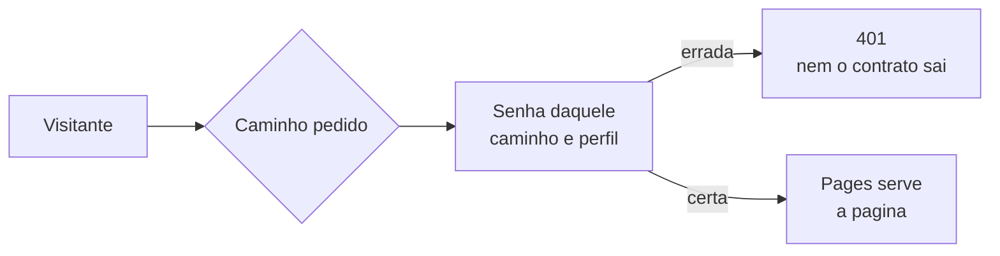

# Portal do Barramento — publicação e controle de acesso

Documentação da API do Barramento Neoh × HIS, escrita em **OpenAPI 3.0.3** e renderizada com
**Redoc**. A fonte da verdade é o **código** (`Barramento.cs` + os controllers da `CC.Api`);
o contrato publicado é conferido campo a campo contra ele a cada alteração.

## O que tem no pacote

| Arquivo | Função |
|---|---|
| `openapi.yaml` | Contrato completo, com Tasy e MV juntos. **É o único arquivo a editar à mão.** |
| `tasy/index.html` + `tasy/openapi-tasy.yaml` | Página do **Tasy** — comuns + Tasy. Gerados. |
| `mv/index.html` + `mv/openapi-mv.yaml` | Página do **MV** — comuns + MV. Gerados. |
| `de-para/index.html` | **De-para** portal × código, uso interno. Gerada de dados. |
| `index.html` | Página neutra da raiz: não leva a lugar nenhum. Gerada. |
| `_headers` | Cabeçalhos do Cloudflare Pages: `noindex` e sem cache do contrato. |
| `robots.txt` | Bloqueia indexação. |
| `acesso.js` | **As regras de acesso.** Quem decide quem entra em qual caminho. |
| `worker.js` + `wrangler.jsonc` | Ponto de entrada quando o projeto é um **Worker com assets**. |
| `functions/_middleware.js` | Ponto de entrada quando o projeto é do tipo **Pages**. |
| `.assetsignore` | Tira do site os arquivos acima, que são código, não conteúdo. |
| `.nojekyll` | Herança do GitHub Pages; inofensivo. |

Não existe página "Geral": o que vale para qualquer HIS é publicado **dentro** da página de
cada HIS, marcado operação a operação como comum. Um hospital Tasy lê uma página só.

**O contrato de cada HIS mora dentro da pasta dele**, e não na raiz. Isso não é detalhe de
organização: é o que permite proteger por caminho. Se o `openapi-tasy.yaml` ficasse na raiz,
liberar `/tasy*` para o integrador não bastaria — a página abriria e o Redoc levaria erro ao
buscar o contrato.

### Os endereços

| Quem | Link |
|---|---|
| Hospital/integrador **Tasy** | `<site>/tasy/` |
| Hospital/integrador **MV** | `<site>/mv/` |
| Time interno (de-para) | `<site>/de-para/` |
| Raiz | página neutra, sem links |

Cada página é **isolada**: não tem barra de abas nem link para as outras. Quem recebe o
endereço do Tasy não vê que existe um `/mv/` ou um `/de-para/`. Isso **esconde, não protege** —
quem digitar `/mv/` chega lá. O que protege é a política por caminho, abaixo.

## Como o acesso funciona

Uma função de middleware roda no Cloudflare Pages **antes** de qualquer arquivo ser servido —
inclusive um `.yaml` aberto direto na barra de endereço. É isso que uma trava em JavaScript
dentro da página não faz.



Cada caminho aceita **duas senhas, uma por perfil**:

| Caminho | Usuário `intelectah` | Usuário `integrador` |
|---|---|---|
| `/tasy/*` | `SENHA_INTELECTAH_TASY` | `SENHA_INTEGRADOR_TASY` |
| `/mv/*` | `SENHA_INTELECTAH_MV` | `SENHA_INTEGRADOR_MV` |
| `/de-para/*` | `SENHA_INTELECTAH_DEPARA` | — |
| tudo o mais (raiz, `openapi.yaml`) | `SENHA_INTELECTAH_RAIZ` | — |

O integrador recebe usuário `integrador` e a senha do HIS dele. O time interno usa
`intelectah` com a senha daquele caminho. A separação por perfil serve para uma coisa
prática: quando um integrador sai do projeto, troca-se só a senha dele e o time interno
continua entrando.

Se preferir uma senha interna só para tudo, basta repetir o mesmo valor nas quatro variáveis
`SENHA_INTELECTAH_*`. A função não muda.

**Fechado por omissão:** variável não preenchida = ninguém entra por ali. Esquecer de
configurar tranca, não abre.

## Publicar (uma vez)

**1. Criar o projeto, e saber de que tipo ele é**

O Cloudflare hoje cria dois tipos de projeto a partir de um repositório, e **o controle de
acesso entra por portas diferentes em cada um**:

| Tipo | Como reconhecer | Quem roda |
|---|---|---|
| **Pages** | o painel fala em *Functions*, o endereço é `*.pages.dev` | `functions/_middleware.js` |
| **Worker com assets** | o painel tem abas *Bindings* e *Observability*, e diz *"a Worker that only has static assets"* | `worker.js` + `wrangler.jsonc` |

Os dois estão prontos no repositório e chamam as mesmas regras, em `acesso.js`. Não é preciso
escolher antes: o tipo do projeto decide qual entra em uso.

*Workers & Pages → Create → Connect to Git* → repositório
`barramentointelectah/barramento.intelectah-docs`, branch `main`. Se a tela oferecer **Pages**,
prefira: build command vazio, output directory `/`, framework preset None.

Se o projeto for um Worker, confira em *Settings → Build* que o comando de deploy é o do
wrangler (o padrão, `npx wrangler deploy`) — é ele que lê o `wrangler.jsonc` e liga o
`run_worker_first`, sem o qual o arquivo estático sairia sem passar pela verificação.

**2. Cadastrar as senhas**

*Settings → Environment variables → Production → Add variable*, uma para cada linha da tabela
acima. Marque **Encrypt** em todas — assim ficam ilegíveis até para quem abre o painel depois.

Gere senhas longas e aleatórias; elas não são digitadas de memória, ficam salvas no navegador
de quem usa. Um gerador de senha de 24 caracteres serve.

Depois de salvar, **refaça o deploy** (*Deployments → Retry deployment*): variável nova só
vale para deploys seguintes.

**3. Testar**

Numa janela anônima:

- `<site>/tasy/` → pede usuário e senha; entre com `integrador` + a senha do Tasy
- `<site>/tasy/openapi-tasy.yaml` → **deve abrir sem pedir de novo** (a sessão vale para o
  caminho inteiro) — é o teste que importa: prova que o contrato está protegido junto
- `<site>/mv/` → a senha do Tasy **não** pode entrar
- `<site>/openapi.yaml` → só com `intelectah` + `SENHA_INTELECTAH_RAIZ`

**4. Desligar o GitHub Pages — este passo não é opcional**

*Settings → Pages* do repositório: desligue. Enquanto o Pages estiver no ar,
`barramentointelectah.github.io/barramento.intelectah-docs` serve tudo sem pedir nada, e a
proteção do Cloudflare vale só para o endereço do Cloudflare.

Em seguida, **torne o repositório privado** (*Settings → General → Danger Zone*). O Cloudflare
continua publicando normalmente.

**5. Repositório antigo** (`thiagopaz/barramento-docs`): desligue o Pages e arquive.

## Dar e tirar acesso

- **Liberar alguém:** mande o usuário (`integrador` ou `intelectah`) e a senha do caminho dele.
- **Tirar o acesso:** troque a senha daquele caminho e perfil em *Settings → Environment
  variables*, refaça o deploy e avise quem continua. É por isso que a senha do integrador é
  separada da interna — trocar uma não derruba a outra.
- **Trocar por rotina:** vale trocar as senhas de integrador a cada entrega concluída.

Mantenha o registro de quem recebeu qual senha em `OFICIAL/ACESSOS-PORTAL.md`.

**O que este desenho não dá,** e é bom saber antes de precisar: senha é compartilhada, então
não há registro de quem entrou, e quem tem a senha pode repassá-la. Para documentação de
contrato, sem dado de paciente, o risco é aceitável. Se um dia precisar de acesso por pessoa,
com log e revogação individual, o caminho é o Cloudflare Access — que tem plano gratuito —, e
a migração é trocar esta função pelas políticas do Access, sem tocar no conteúdo.

## Atualizar a documentação

1. Edite `openapi.yaml`. Qualquer ajuste de contrato reflete o **código** — nunca o contrário.
2. Confira contra o código. A conferência também recusa YAML com chave duplicada, que derruba
   o Redoc inteiro:
   ```bash
   cd OFICIAL
   python3 .sync/conferir-contrato.py
   ```
3. Regere as páginas:
   ```bash
   python3 .sync/gerar-portal.py     # Tasy e MV
   python3 .sync/gerar-de-para.py    # de-para
   ```
4. `git commit` + `git push`. O Cloudflare Pages republica sozinho a cada push.

### O que controla o quê

| Arquivo em `.sync/` | Para que serve |
|---|---|
| `escopos.json` | Escopo de cada operação: `geral`, `tasy` ou `mv`. Decide em que página ela entra. |
| `mapa-conferencia.json` | Liga cada operação publicada ao método do código, à classe do payload e ao parâmetro de URL. |
| `conferencia.json` | Resultado da última conferência. Gerado — alimenta o de-para. |

A ordem do menu lateral sai da lista `tags` no topo do `openapi.yaml`. Uma ordem só serve às
duas páginas: o gerador remove de cada uma os grupos que ficaram sem operação.

## Versão offline

`portal-barramento-api.html` é um arquivo autocontido, de quando o portal era uma página só.
**Está desatualizado e nenhum gerador o reescreve** — não mande para ninguém sem regerar. Ou
se decide regerá-lo no pipeline, ou se apaga.

---
*Contrato conferido campo a campo contra o código. Onde a planilha do cliente e o código
divergem, o portal segue o código.*
