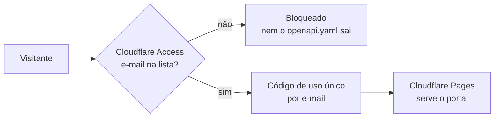

# Portal do Barramento — publicação e controle de acesso

Portal de documentação da API do Barramento, gerado a partir do **OpenAPI 3.0.3**
(`openapi.yaml`) e renderizado com **Redoc**. Fonte da verdade = **código-fonte
(`Barramento.cs` + `CC.Api`) + planilhas OFICIAL**. Genérico (Tasy/MV) — sem dependência de
HIS específico.

O portal é **de acesso restrito**: quem entra é o e-mail que estiver na lista do
Cloudflare Access.

## Conteúdo do pacote

| Arquivo | Função |
|---|---|
| `openapi.yaml` | Especificação OpenAPI 3.0.3 completa. **É o único arquivo a editar.** |
| `index.html` + `openapi-geral.yaml` | Aba **Geral** — rotas que valem para qualquer HIS. Gerados. |
| `tasy.html` + `openapi-tasy.yaml` | Aba **Tasy** — geral + Tasy, autocontida. Gerados. |
| `mv.html` + `openapi-mv.yaml` | Aba **MV** — geral + MV, autocontida. Gerados. |
| `de-para.html` | Aba **De-para**. Gerada de dados (contrato + conferência + escopos + fontes). |
| `_headers` | Cabeçalhos do Cloudflare Pages: `noindex`, sem cache do contrato. |
| `robots.txt` | Bloqueia indexação. |
| `.nojekyll` | Herança do GitHub Pages; inofensivo no Cloudflare. |

## Como o acesso funciona



O bloqueio acontece **antes** do arquivo ser servido: vale para todas as URLs, inclusive
`openapi.yaml` e `de-para.html` abertos direto. Isso é o que uma trava em JavaScript na
página **não** faz.

## Publicar (uma vez)

1. **Cloudflare Pages → Create a project → Connect to Git**, apontando para
   `thiagopaz/barramento-docs`, branch `main`.
   - Framework preset: **None**
   - Build command: *(vazio)*
   - Build output directory: `/`
2. Aguarde o primeiro deploy. Vai nascer um endereço `*.pages.dev`.
3. **Zero Trust → Access → Applications → Add an application → Self-hosted**:
   - Application domain: o domínio do passo 2 (ou o domínio próprio, se usar um)
   - Session duration: 24 horas é um bom começo
4. Na política da aplicação:
   - Policy name: `Integradores do barramento`
   - Action: **Allow**
   - Include: **Emails** → cole a lista, um por linha; para o time inteiro use
     **Emails ending in** → `@intelectah.com.br`
5. **Zero Trust → Settings → Authentication → Login methods**: deixe **One-time PIN**
   ligado. É o que faz o visitante externo receber um código no e-mail, sem criar conta.
6. **Desligue o GitHub Pages** em Settings → Pages do repositório e, de preferência,
   **torne o repositório privado**. Enquanto o Pages estiver no ar, o endereço
   `thiagopaz.github.io/barramento-docs` continua servindo tudo sem pedir nada — a
   proteção do Cloudflare vale só para o endereço do Cloudflare.

## Dar e tirar acesso

Tudo na política do passo 4, sem mexer no repositório:

- **Liberar alguém:** acrescente o e-mail em *Include → Emails* e salve. Vale na hora.
- **Tirar o acesso:** remova o e-mail e, em **Access → Sessions**, revogue as sessões
  ativas daquela pessoa (senão ela segue dentro até a sessão expirar).
- **Quem entrou e quando:** **Zero Trust → Logs → Access**.
- O link `Sair` no topo do portal chama `/cdn-cgi/access/logout` e encerra a sessão.

Mantenha a lista de quem tem acesso em `OFICIAL/ACESSOS-PORTAL.md` — o registro é nosso;
a lista que vale é a do Cloudflare.

## Atualizar a documentação

1. Edite `openapi.yaml` (é a fonte; qualquer ajuste de contrato deve refletir o **código**,
   nunca o contrário).
2. Rode a conferência contra o código — ela também recusa YAML com chave duplicada, que
   derruba o Redoc inteiro:
   ```bash
   cd OFICIAL
   python3 .sync/conferir-contrato.py
   ```
3. Regere as abas:
   ```bash
   python3 .sync/gerar-portal.py     # Geral, Tasy e MV
   python3 .sync/gerar-de-para.py    # aba De-para
   ```
4. `git commit` + `git push`. O Cloudflare Pages republica sozinho a cada push.

### O que controla o quê

| Arquivo em `.sync/` | Para que serve |
|---|---|
| `escopos.json` | Escopo de cada operação: `geral`, `tasy` ou `mv`. Decide em que aba ela entra. |
| `fontes-oficial.json` | De onde sai o contrato de cada operação na OFICIAL (arquivo e aba). O gerador avisa quando o arquivo citado some. |
| `lacunas.json` | O que está fora do portal: fila de publicação e o que só existe no código. |
| `conferencia.json` | Resultado da última conferência contra o código. Gerado. |

## Versão offline (para enviar por e-mail)

`portal-barramento-api.html` é **autocontido**: abre com duplo clique, sem internet e sem
servidor. Não passa pelo Access — quem receber o arquivo lê o conteúdo. Use só com quem já
está na lista. Regere-o junto com o `openapi.yaml`.

---
*Documentação de contrato conferida campo a campo contra o código. Onde a planilha do cliente
e o código divergem, o portal segue o código.*
